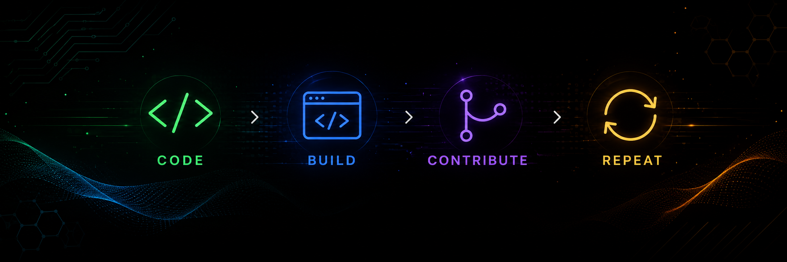

  

**Code -> Build -> Contribute -> Repeat**

Hi! , I'm Kunwartejpal Singh Sidhu

`KunwarSidhu47`

**Fourth-year B.Tech Computer Science & Engineering Student @ NIT Jalandhar (Dr. B. R. Ambedkar National Institute of Technology)**

**Open Source Contributor / Full-Stack Developer / DSA**

Currently contributing to **Project HAMi (CNCF)** and participating in **GirlScript Summer of Code (GSSoC) 2026**, while building full-stack web applications.

- 🛠 **Project HAMi (CNCF)** — Contributing to GPU virtualization and heterogeneous AI compute orchestration for Kubernetes.
- 🌟 **GirlScript Summer of Code (GSSoC) 2026** — Contributor, **Ranked #395 Globally**
- ✅ **25+ Merged Pull Requests** across multiple production-grade open-source repositories.

---

## 💻 Tech Stack

  
  
  
  
  
  
  
  
  
  
  
  

---

## 📊 GitHub Stats

---

## 🤝 Connect

  

  

